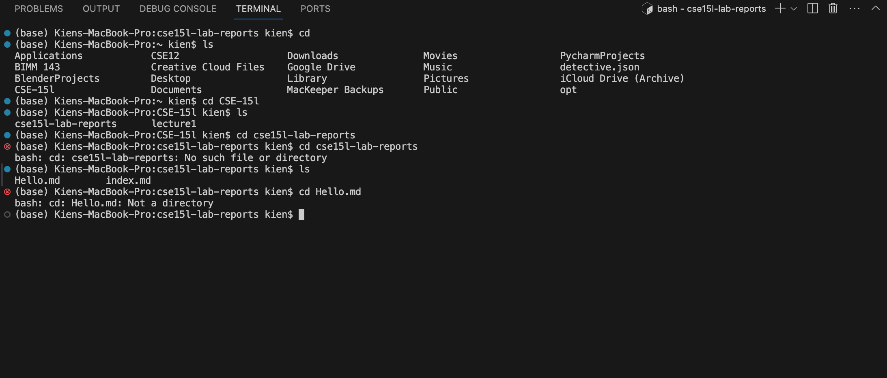
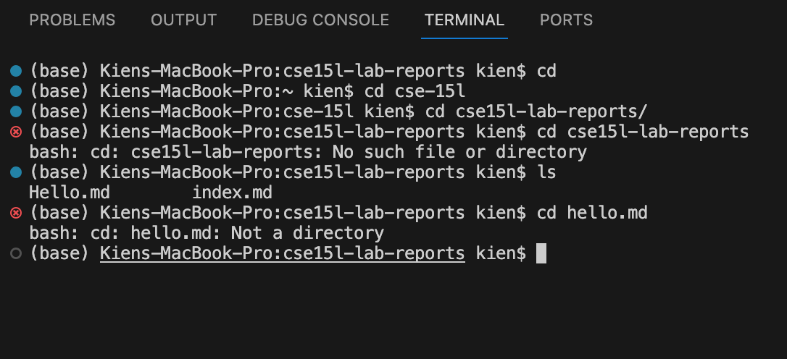
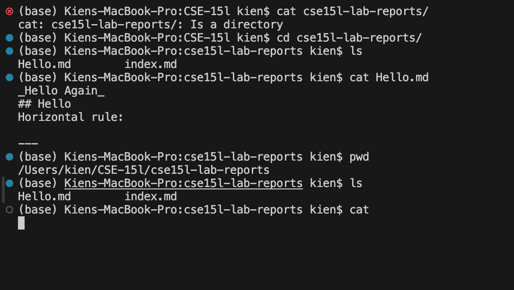

CD:

/Users/kien/CSE 15l/cse15l-lab-reports
Running ‘cd’ with no arguments returns nothing because if there are no arguments being passed then the working directory isn’t being changed. This takes us to the root directory.

Running ‘cd’ with the path to the ‘cse15l-lab-reports’ returns an error stating that there are “No such file or directory” because we are already in the directory and are looking to find another directory given that we are in one. If we were to step out of the directory backwards then we can cd into this directory or if there were another directory in this one then we would be able to cd into that one.

Running ‘cd’ on any file returns “Not a directory,” because you can’t ‘cd’ into a file. Because you can only ‘cd’ into directory, cd with an argument of a file will lead in this error.

LS:

/Users/kien/CSE 15l/cse15l-lab-reports
Running ‘ls’ with no arguments returns ‘Hello.md’ and ‘index.md’ because these are the files and folders within the directory.

Running `ls` with the directory of cse15l-lab-reports while being in that directory will lead to an error of “No such file or directory” because we are in that directory and there isn’t a forward directory with that name. This would return the folders and files in cse15l-lab-reports if we were in the directory one backwards from the cse15l-lab-reports folder.

Running `ls` on Hello.md would lead to the terminal returning Hello.md because that is the only file within Hello.md.

Cat:

/Users/kien/CSE-15l
Running `cat` without any arguments in the terminal leads to nothing happening and then the terminal in a stalling or frozen state waiting for an input from the user. This is because the terminal can’t concatenate nothing so it is now waiting for two paths to be concatenated. 

Running `cat` with a path to a directory leads to the error “cat: cse15l-lab-reports/: Is a directory” because `cat` is designed to work on files and not directories.

Running `cat` on my file Hello.md prints out the text within the file because cat is used to display the contents of a certain file, using cat on multiple files will concatenate data from different files into the terminal.

